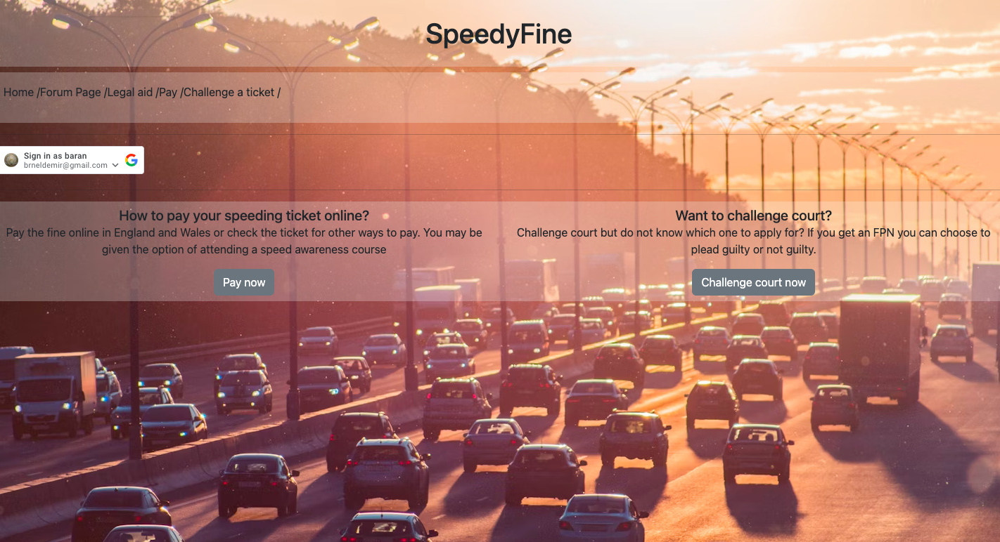
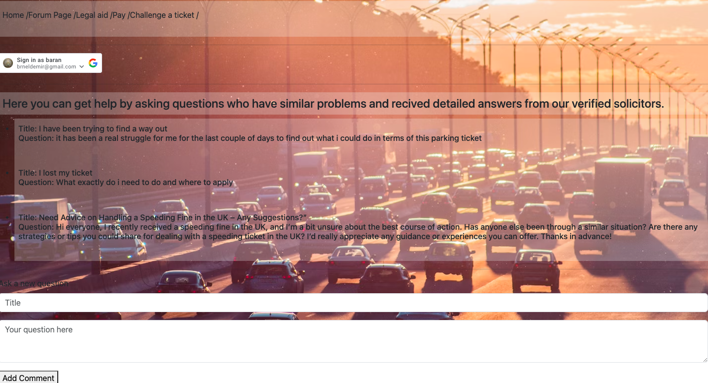

#  Project-1: SpeedyFine 

#### General Assembly SEI Project-2 | SpeedyFine | Vanilla JavaScript, HTML & CSS | 1-week | Solo project





## Overview

This web application was made as the final project for Unit 2. It follows a MEVN structure with MongoDB, Express, Vue and Node. My project aim was creating a platform where individuals could gain insights into the various approaches and solutions available when facing speeding or parking tickets. Users would input specific details of their ticket, and the site would provide guidance, highlighting deadlines and potential solutions. I wanted to have Google authorisation API for user authentication, and featuring a forum chat where users can comment and seek assistance. 


## Deployment

The app has been deployed and is available [here](https://speedyfine.netlify.app/).

## Getting started

This project is separated into two repos, frontend and [backend](https://github.com/baraneldemir/Unit2_Project_Backend)). 

1. Access the source code via the 'Clone or download' button 
2. In CLI, run `npm i` on the root level to install dependencies
3. Run `npm run dev` to run the program in your local environment

## Goal and timeframe:

This was a solo project and was to be completed in a week.

## Technologies used:

* MongoDB
* Express.js
* Node.js
* JavaScript

## Brief:
☐ **Have at least 2 data entities (data resources) in addition to the `User` Model** - one entity that represents the main functional idea for your app and another with a **One:Many** or **Many:Many** relationship with that main entity (embedded or referenced).
☐ **Use OAuth authentication**.
☐ Implement basic **authorization** that restricts access to features that need a logged in user in order to work (typically CUD data operations) by "protecting" those routes from anonymous users using the `ensureLoggedIn` middleware from the OAuth lesson. In addition, ensure that editing and deletion of a data resource can only be done by the user that created that data (this is done in the controller - refer to the Guide to User-Centric CRUD).
☐ Have **full-CRUD data operations** somewhere within the app's features. For example, you can have functionality that **C**reates & **U**pdates a _post_ and satisfy **D**elete functionality by implementing the ability to delete _comments_.
☐ Be styled such that the app looks and feels similar to apps we use on a daily basis - in other words, **it should have a consistent and polished user interface.**
☐ Be **deployed online**

## Planning:
First of all I started planning about the paths in my app, how the navigation through the application should go. I have decided must haves such as a home page with Google Auth functionalities, a forum page where users can interract with each other, a legal aid page for users to send forms. a pay section about how to pay a ticket.


## Process
<p>At the beginning I created the initial setup of frontend and backend folders and respective repos. After that I have created the endpoints on the backend. Organised some of the basic structure of the frontend</p>

<p>After all setup was done I finally started adding first couple of frontend pages. After creating some basic styling in the frontend I have created the GET and POST methods.</p>

###### Recieving Comments and loading them
```javascript
const fetchData = () => {
    fetch(`${import.meta.env.VITE_API_URL}/comments`)
        .then(response => response.json())
        .then(result => {
            commentsBe.value = result
        })
}
```

###### Posting Comments
```javascript
function addComment() {
    if (comment.value.title === '' || comment.value.text === '') {
        alert('Please fill both areas')
        return
    }
    fetch(`${import.meta.env.VITE_API_URL}/comments/add`, {
        method: "POST",
        headers: {
            "Content-Type": "application/json"
        },
        body: JSON.stringify(comment.value)
    })
        .then(res => {
            comment.value = {
                title: '',
                text: '',
            }
            console.log(res)
        })
        .catch(err => console.error(err))
}
```
<p>Then I have added Delete function for the comments in the forum page</p>

###### Delete function for comments
```javascript
function deleteComment(commentId) {
    fetch(`${import.meta.env.VITE_API_URL}/comments/${commentId}`, {
        method: "DELETE"
    })
    .then(() => {
        alert('Comment deleted')
        fetchData()
    })
}
```
<p>With the Delete method and sending the correct headers I was able to achieve this functionality. After creating all these functions I moved on to creating the Google oAuth. I wanted to have a feature where when the person is signed in the site will display the gmail profile picture of the user. So on the front end I had to decode the token in the cookies get the user profile picture value, and fetch the data associated with the user.</p>

###### user picture and checking session function
```javascript
let userPicture = ref('')
function checkSession() {
    if (cookies.isKey('user_session')) {
        isLoggedIn.value = true
        const userData = decodeCredential(cookies.get('user_session'))
        userName.value = userData.given_name
        userPicture.value = userData.picture
    }
```
###### And fetching the user picture in callback function
```javascript
function callback(response) {
    isLoggedIn.value = true
    const userData = decodeCredential(response.credential)
    userName.value = userData.given_name
    userPicture.value = userData.picture
    cookies.set('user_session', response.credential)
    fetch(`${import.meta.env.VITE_API_URL}/user/login`, {
        method: "POST",
        headers: {
            "Content-Type": "application/json"
        },
        body: JSON.stringify({
            userEmail: userData.email

        })
    })
        .then(() => {
            console.log('session saved');
        })
        .catch(err => console.error(err))
    //if you dont give data to fetch post will become get by default
}
```
<p>After the authentication of the users. I proceed on the last CRUD functionality i was missing which was Update. For this I have created a Edit function.</p>

###### Update function and loading a single comment to edit 
```javascript
const updateComment = () => {
    fetch(`${import.meta.env.VITE_API_URL}/comments/${commentId}`, {
        method: "PUT",
        headers: {
            "Content-Type": "application/json"
        },
        body: JSON.stringify(comment.value)
    })
    .then(() => {
        //replace or push same
        router.replace({name: 'comments'})
    })
    .catch(err => console.error(err))
}
function LoadCommentData () {
    fetch(`${import.meta.env.VITE_API_URL}/comments/${commentId}`)
    .then(res => res.json())
    .then(data => {
        comment.value =  {
            title: data.title,
            text: data.text,
        }
        console.log(comment.value);
    }) 
}
```
<p>After having full CRUD functionality I have added some front end styling and some information that users might find useful. Last but not least, I deployed with netlify</p>


### Challenges

The most challenging part was loading the single comments to edit. I had to try a couple of different approaches and ended up structuring it by having an another page to edit the comment. 
I had some bugs with authorisation along the way. It was not displaying anything when the user was logged in. I have solved the problem by refacturing the code again and going step by step.
Also adding structural information to the website is more time consuming than what I have planned initially.


### Wins

The biggest win I had with this project was getting comfartable with autharisations and using different AUTH api's to handle and implementing this feature to the site.
Other than that, seeing a web application that you created for the first time and seeing your friends or other people using it was a great pleasure to see and motivated me for the future applications.

## Key learnings
I feel a lot more comfortable with creating the CRUDS in the backend and fetching them from the frontend at the moment. Everything was quite new when I first started to this project. But this challenging side of getting into new brand thing was really enjoyable. 

## Future Improvements

If I had more time I would add more features to the site such as more useful information on how to challenge a ticket. And how to pay a ticket and what paths to take. But since these are information that are need to be searched and implementing takes way longer than expected.


